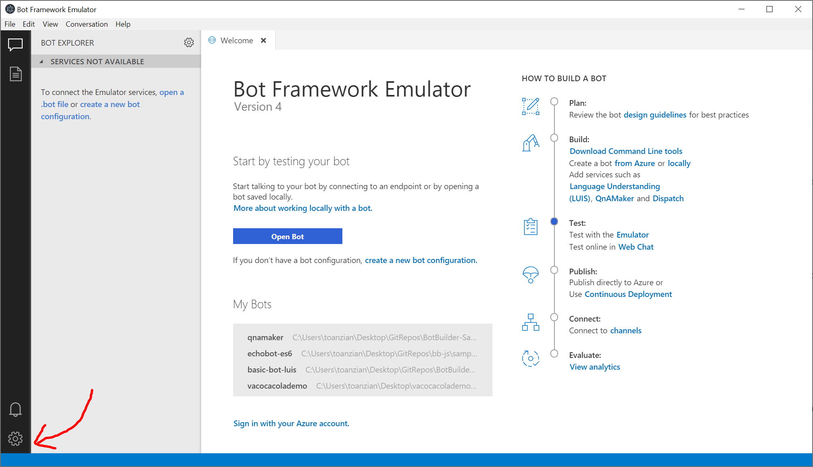
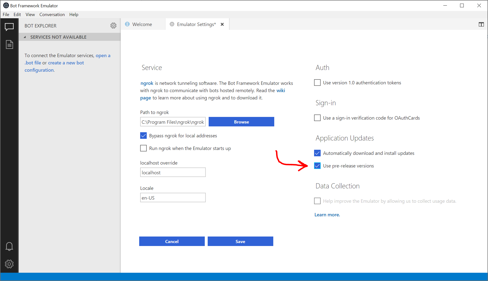
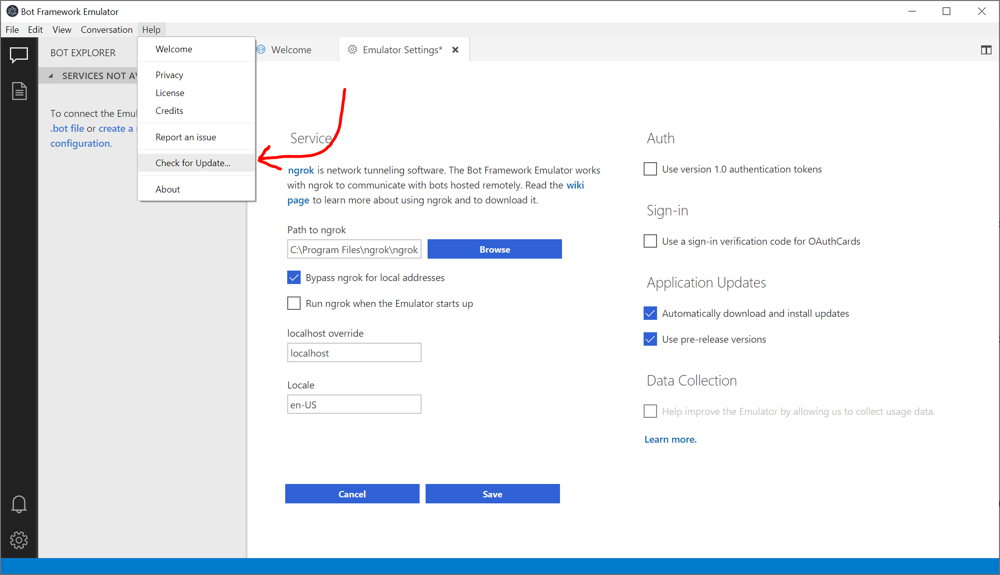
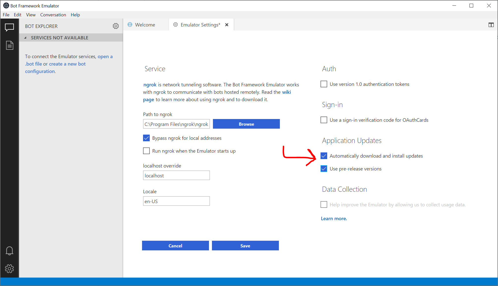

# Nightly Releases of the [Bot Framework Emulator](https://github.com/Microsoft/BotFramework-Emulator)

This repository is where nightly releases of the [Bot Framework Emulator](https://github.com/Microsoft/BotFramework-Emulator) are published.

**Note:** These releases aren't considered stable and contain the latest features in the Emulator.

# Auto Update to Nightly Releases via Emulator

If you want to use the latest nightly build without visiting this repository, you can do that directly through the Emulator!

1. Start the Emulator and navigate to the Settings page.

    

2. Check the checkbox labelled "Use pre-release versions."

    

3. Check for updates

    * If you want to **manually check** for a new nightly, navigate to the Help menu, and then click "Check for Update..."

     

    * If you want the Emulator to **automatically check** for and install updates on startup, check the checkbox labelled "Automatically download and install updates" on the Settings page.

    

# Contributing

This project welcomes contributions and suggestions.  Most contributions require you to agree to a
Contributor License Agreement (CLA) declaring that you have the right to, and actually do, grant us
the rights to use your contribution. For details, visit https://cla.microsoft.com.

When you submit a pull request, a CLA-bot will automatically determine whether you need to provide
a CLA and decorate the PR appropriately (e.g., label, comment). Simply follow the instructions
provided by the bot. You will only need to do this once across all repos using our CLA.

This project has adopted the [Microsoft Open Source Code of Conduct](https://opensource.microsoft.com/codeofconduct/).
For more information see the [Code of Conduct FAQ](https://opensource.microsoft.com/codeofconduct/faq/) or
contact [opencode@microsoft.com](mailto:opencode@microsoft.com) with any additional questions or comments.
